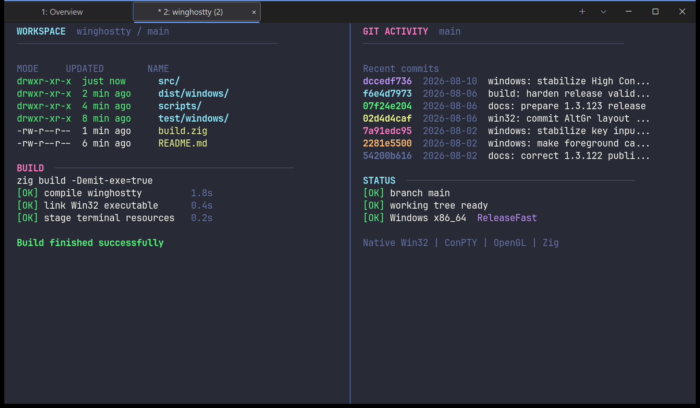

<p align="center">
  <picture>
    <source media="(prefers-color-scheme: dark)" srcset="images/winghostty-flag.svg" />
    
  </picture>
</p>

<p align="center">
  <em>Ghostty's terminal core in a fast, native Windows app.</em>
  <br />
  Tabs, splits, and session restore · Native Win32, OpenGL renderer · No telemetry
</p>

<p align="center">
  <a href="https://github.com/amanthanvi/winghostty/releases">Releases</a>
  ·
  <a href="docs/getting-started.md">Getting started</a>
  ·
  <a href="docs/windows.md">Windows</a>
  ·
  <a href="docs/status.md">Status</a>
  ·
  <a href="CONTRIBUTING.md">Contributing</a>
</p>

<p align="center">
  
</p>

---

## What is winghostty?

winghostty is a terminal emulator for Windows, built on the terminal
core of [Ghostty](https://github.com/ghostty-org/ghostty) and wrapped in
a Win32 app written for this fork. That gets you:

- Native tabs, splits, and right-click context menus
- Session restore that brings back your tabs, splits, and working
  directories
- A fuzzy-searched palette for actions, tabs, panes, profiles, and
  settings
- A shell picker for PowerShell, cmd, Git Bash, and WSL
- Dark title bar, per-monitor DPI scaling, IME input, and file
  drag-and-drop
- Ghostty's engine underneath: true color, Kitty graphics, shell
  integration, and most Ghostty config options and themes
- No telemetry, and crash dumps are never uploaded

winghostty is built for developers who are comfortable editing a
plain-text config file and clicking through a SmartScreen warning on
first install.

## Install

winghostty runs on Windows 10 and 11, x64 and ARM64, and needs a GPU
driver with OpenGL 4.3 or newer. Latest stable release:
[winghostty 1.3.123](https://github.com/amanthanvi/winghostty/releases/tag/v1.3.123),
published 2026-08-06.

```powershell
winget install AmanThanvi.winghostty
```

Or with Scoop:

```powershell
scoop bucket add winghostty https://github.com/amanthanvi/scoop-winghostty
scoop install winghostty/winghostty
```

Or download directly from
[Releases](https://github.com/amanthanvi/winghostty/releases). The
installers add a Start menu entry; the portable ZIPs run from any
folder:

| File                                                                                                                                                                 | What it is      |
| -------------------------------------------------------------------------------------------------------------------------------------------------------------------- | --------------- |
| [`winghostty-1.3.123-windows-x64-setup.exe`](https://github.com/amanthanvi/winghostty/releases/download/v1.3.123/winghostty-1.3.123-windows-x64-setup.exe)           | x64 installer   |
| [`winghostty-1.3.123-windows-arm64-setup.exe`](https://github.com/amanthanvi/winghostty/releases/download/v1.3.123/winghostty-1.3.123-windows-arm64-setup.exe)       | ARM64 installer |
| [`winghostty-1.3.123-windows-x64-portable.zip`](https://github.com/amanthanvi/winghostty/releases/download/v1.3.123/winghostty-1.3.123-windows-x64-portable.zip)     | x64 portable    |
| [`winghostty-1.3.123-windows-arm64-portable.zip`](https://github.com/amanthanvi/winghostty/releases/download/v1.3.123/winghostty-1.3.123-windows-arm64-portable.zip) | ARM64 portable  |
| [`SHA256SUMS-windows-x64.txt`](https://github.com/amanthanvi/winghostty/releases/download/v1.3.123/SHA256SUMS-windows-x64.txt)                                       | x64 checksums   |
| [`SHA256SUMS-windows-arm64.txt`](https://github.com/amanthanvi/winghostty/releases/download/v1.3.123/SHA256SUMS-windows-arm64.txt)                                   | ARM64 checksums |

The older
[`SHA256SUMS.txt`](https://github.com/amanthanvi/winghostty/releases/download/v1.3.123/SHA256SUMS.txt)
is still published as an x64 auto-update compatibility alias.

The installers and the binaries inside the portable ZIP are
Authenticode-signed with a self-signed certificate; the ZIP container
itself is checksummed, not signed. SmartScreen warns on first run
because that certificate carries no publisher reputation, so check the
download against its checksum file before you run it.
[docs/getting-started.md](docs/getting-started.md) explains the warning
and walks through install, portable use, and uninstall.

## First launch

On first launch, winghostty writes a config template to
`%LOCALAPPDATA%\winghostty\config.ghostty`. The template sets no options;
defaults live in the binary. A minimal config:

```ini
font-family = JetBrains Mono
font-size   = 12
# Pick a theme from: winghostty +list-themes
# Theme files are config files; only use themes from sources you trust.
theme       = Dracula
```

Reload config without restarting: `Ctrl+Shift+,`

A few keybindings to get moving: `Ctrl+Shift+T` opens a tab,
`Ctrl+Shift+\` and `Ctrl+Shift+E` split, `Alt+Arrow` moves between
panes, `Ctrl+Shift+P` opens the command palette, and `Ctrl+Shift+C` /
`Ctrl+Shift+V` copy and paste. The full table, plus how to rebind, is in
[docs/getting-started.md](docs/getting-started.md#5-keybindings).

## Status

winghostty is young: it has a single maintainer, and its first public
release was April 2026. It installs as its own top-level app, so you can
keep Windows Terminal, WezTerm, or Alacritty next to it while you try
it. macOS and Linux app runtimes are not planned.

What works, what's experimental, and what's out of scope is tracked in
[docs/status.md](docs/status.md). For a feature-by-feature comparison
with upstream Ghostty, see
[docs/windows-capability-matrix.md](docs/windows-capability-matrix.md).

Questions and feedback go to
[Discussions](https://github.com/amanthanvi/winghostty/discussions).
GitHub Issues are reserved for reproducible bugs.

## Privacy, updates, and crashes

winghostty sends no telemetry and no analytics. The only outbound
network activity is the GitHub Releases updater, and only when you
enable `auto-update`. It checks at most once every 24 hours, can stage a
verified installer in `download` mode, and never installs anything
without you starting it.

Crash dumps are never uploaded; they stay under
`%LOCALAPPDATA%\winghostty\crash`, readable with
`winghostty +crash-report`. If a broken config or saved session state
blocks launch, `winghostty --safe-mode` starts once with built-in
defaults.

Updater verification, crash-report details, and diagnostic bundles are
documented in [docs/windows.md](docs/windows.md).

## Build from source

Most users should install from Releases. Building needs Windows 10/11 on
x64 or ARM64, Zig 0.15.x (patch ≥ 2), Visual Studio 2022 with the MSVC
toolchain on PATH, and Git for Windows. Then build:

```powershell
zig build -Demit-exe=true
```

Output lands at `zig-out\bin\winghostty.exe`. Toolchain details,
dependency cache seeding, the pre-configured dev shell, and test commands
are in [HACKING.md](HACKING.md). Building the installer and portable ZIP
yourself is covered in [PACKAGING.md](PACKAGING.md).

## Relationship to Ghostty

winghostty is a fork of Ghostty: upstream is tracked as the `upstream`
Git remote, and the fork relationship is visible in full Git history.

Shared with upstream: the terminal core (`src/terminal/`), fonts
(`src/font/`), the renderer (`src/renderer/`), input, config, termio,
crash handling, shell integration, the inspector (`src/inspector/`), and
`libghostty-vt`, the Ghostty VT library, which still builds here for Zig
and C projects.

New in this fork: the Win32 runtime (`src/apprt/win32.zig`,
`src/apprt/win32_theme.zig`), the D3D11/DirectComposition window-chrome
pipeline, the updater (`src/update/github_releases.zig`), and the
Windows packaging (`dist/windows/`, `scripts/package-windows.ps1`).

Removed: the upstream `macos/` Xcode project, the `src/apprt/gtk/`
runtime, and Flatpak, Snap, and other Linux desktop packaging.

Because the core is shared, most Ghostty configuration options, themes,
and shell-integration behavior apply here directly. When Windows-native
behavior conflicts with upstream cross-platform behavior, this fork
prefers the Windows-native result.

## Contributing

Bug reports, reproducible issues, and focused PRs are welcome. Read
[CONTRIBUTING.md](CONTRIBUTING.md) and [AI_POLICY.md](AI_POLICY.md)
first. For usage questions and design discussion, use
[Discussions](https://github.com/amanthanvi/winghostty/discussions).
Pull requests get automated review from Greptile:

[](https://www.greptile.com/?utm_source=oss_badge&utm_medium=readme&utm_campaign=greptile_for_open_source)

## License

MIT. Copyright © 2024 Mitchell Hashimoto, Ghostty contributors. See
[LICENSE](LICENSE).

Fork-specific changes are contributed under the same license by the
fork's maintainer and contributors.
