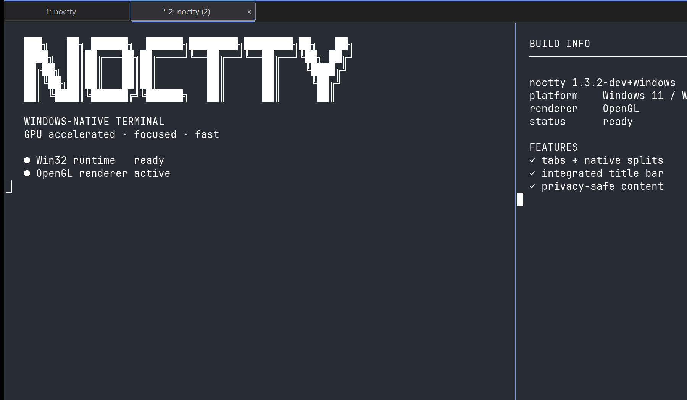

<p align="center">
  <picture>
    <source media="(prefers-color-scheme: dark)" srcset="images/noctty-flag.svg" />
    
  </picture>
</p>

<p align="center">
  <strong>A native Windows terminal built on Ghostty's terminal core.</strong>
  <br />
  Tabs, splits, and session restore · Win32 and OpenGL · No telemetry
</p>

<p align="center">
  <a href="https://github.com/amanthanvi/noctty/releases/latest">Download</a>
  ·
  <a href="https://noctty.com">Website</a>
  ·
  <a href="docs/getting-started.md">Getting started</a>
  ·
  <a href="docs/windows.md">Windows guide</a>
  ·
  <a href="docs/status.md">Status</a>
  ·
  <a href="CONTRIBUTING.md">Contributing</a>
</p>

<p align="center">
  <sub>Formerly <strong>winghostty</strong>. Renamed in August 2026 after a <a href="https://github.com/amanthanvi/noctty/issues/119">trademark request from the Ghostty team</a>.</sub>
</p>

<p align="center">
  
</p>

---

Noctty is a Windows terminal that pairs the terminal core from
[Ghostty](https://github.com/ghostty-org/ghostty) with a native Win32 app
written for this fork.

- **Native Windows UI:** tabs, splits, and context menus, per-monitor DPI
  scaling, and IME input.
- **Your shells, found for you:** a shell picker for PowerShell, cmd, Git Bash,
  and WSL distributions.
- **Session restore:** windows, tabs, splits, and working directories come
  back the next time you launch. Running programs are not restored.
- **Command palette:** find and run actions from the keyboard.
- **Ghostty config and themes:** most Ghostty options and themes work as they
  are.
- **Private by default:** no telemetry, and crash dumps never leave your PC.

Noctty is young and has one maintainer. It installs alongside your current
terminal and does not replace it, so you can try both side by side. It runs on Windows
only; macOS and Linux are not planned. See [docs/status.md](docs/status.md) for
what works and what is still experimental, and the
[capability matrix](docs/windows-capability-matrix.md) for a feature-by-feature
comparison with upstream Ghostty.

## Install

**Requirements:** Windows 10 version 1809 (build 17763) or later, or
Windows 11, on x64 or ARM64, with a GPU driver that supports OpenGL 4.3 or
later.

- There is no software renderer, so Noctty won't start where OpenGL falls
  back to software. That is common over Remote Desktop and in VMs without 3D
  acceleration.
- On Windows on Arm PCs, first install the free **OpenCL, OpenGL, and Vulkan
  Compatibility Pack** from the Microsoft Store
  ([why](docs/windows.md#windows-on-arm-needs-the-compatibility-pack)).

The latest release is
[noctty 1.3.131](https://github.com/amanthanvi/noctty/releases/tag/v1.3.131),
published 2026-09-24.

### With Scoop

```powershell
scoop bucket add noctty https://github.com/amanthanvi/scoop-noctty
scoop install noctty/noctty
```

A WinGet package is planned but not published yet.

### Direct download

The installer adds a Start menu entry, an "Open noctty here" item to
Explorer's right-click menu, and an uninstaller. The portable ZIP runs from
any folder without installing.

| Your PC                        | Installer                                                                                                                                          | Portable                                                                                                                                                 |
| ------------------------------ | -------------------------------------------------------------------------------------------------------------------------------------------------- | -------------------------------------------------------------------------------------------------------------------------------------------------------- |
| **x64** (Intel and AMD)        | [`noctty-1.3.131-windows-x64-setup.exe`](https://github.com/amanthanvi/noctty/releases/download/v1.3.131/noctty-1.3.131-windows-x64-setup.exe)     | [`noctty-1.3.131-windows-x64-portable.zip`](https://github.com/amanthanvi/noctty/releases/download/v1.3.131/noctty-1.3.131-windows-x64-portable.zip)     |
| **ARM64** (Windows on Arm PCs) | [`noctty-1.3.131-windows-arm64-setup.exe`](https://github.com/amanthanvi/noctty/releases/download/v1.3.131/noctty-1.3.131-windows-arm64-setup.exe) | [`noctty-1.3.131-windows-arm64-portable.zip`](https://github.com/amanthanvi/noctty/releases/download/v1.3.131/noctty-1.3.131-windows-arm64-portable.zip) |

> [!NOTE]
> Releases are signed with a self-signed certificate, so Windows SmartScreen
> shows "Windows protected your PC" when you first run one. Check the download
> first, then click **More info**, then **Run anyway**. Hash the file and
> compare the result with its line in `SHA256SUMS-windows-x64.txt` or
> `SHA256SUMS-windows-arm64.txt` from the same release:
>
> ```powershell
> Get-FileHash .\noctty-1.3.131-windows-x64-setup.exe -Algorithm SHA256
> ```
>
> A matching checksum shows the file arrived intact, not who published it.
> [docs/verify-release.md](docs/verify-release.md) covers the stronger
> provenance and signature checks.

Each release also includes signed manifests of the portable ZIP contents
(`noctty-1.3.131-windows-x64-portable.manifest.ps1` and
`noctty-1.3.131-windows-arm64-portable.manifest.ps1`) and `SHA256SUMS.txt`, an
alias of the x64 checksum file kept for older auto-update clients.

Scoop puts `noctty` on your `PATH`; the installer and the portable ZIP do not.
To run the `noctty` commands in this README, add the install folder to `PATH`
or run `.\noctty.com` from that folder.

For portable mode and uninstalling, see
[docs/getting-started.md](docs/getting-started.md). Switching terminals? There
are guides for moving from
[Windows Terminal](docs/migrate-from-windows-terminal.md) and from
[Git Bash/mintty](docs/migrate-from-git-bash.md).

## Getting started

On first launch, Noctty writes a config template to
`%LOCALAPPDATA%\noctty\config.ghostty`. Every default is built into the app,
so the template sets no options: add only what you want to change. You can
also press <kbd>Ctrl</kbd>+<kbd>,</kbd> to open the Settings window.

```ini
font-family = JetBrains Mono
font-size = 12
theme = Dracula
```

Save the file, then press <kbd>Ctrl</kbd>+<kbd>Shift</kbd>+<kbd>,</kbd> to
reload. Run `noctty +list-themes` to browse the bundled themes.

A few keys to start with:

| Action             | Keys                                                                                          |
| ------------------ | --------------------------------------------------------------------------------------------- |
| Copy / paste       | <kbd>Ctrl</kbd>+<kbd>Shift</kbd>+<kbd>C</kbd> / <kbd>Ctrl</kbd>+<kbd>Shift</kbd>+<kbd>V</kbd> |
| New tab            | <kbd>Ctrl</kbd>+<kbd>Shift</kbd>+<kbd>T</kbd>                                                 |
| Split right        | <kbd>Ctrl</kbd>+<kbd>Shift</kbd>+<kbd>\\</kbd>                                                |
| Split down         | <kbd>Ctrl</kbd>+<kbd>Shift</kbd>+<kbd>E</kbd>                                                 |
| Move between panes | <kbd>Alt</kbd>+arrow keys                                                                     |
| Command palette    | <kbd>Ctrl</kbd>+<kbd>Shift</kbd>+<kbd>P</kbd>                                                 |
| Search             | <kbd>Ctrl</kbd>+<kbd>Shift</kbd>+<kbd>F</kbd>                                                 |
| Settings           | <kbd>Ctrl</kbd>+<kbd>,</kbd>                                                                  |
| Reload config      | <kbd>Ctrl</kbd>+<kbd>Shift</kbd>+<kbd>,</kbd>                                                 |

The full list, and how to rebind keys, is in
[docs/getting-started.md](docs/getting-started.md#keybindings). To drive
Noctty from scripts and the command line, see
[docs/automation.md](docs/automation.md).

## Privacy and updates

- **No telemetry.** Noctty goes online only to reach GitHub Releases for
  updates.
- **Updates** are checked when Noctty starts, at most once every 24 hours.
  Nothing is installed until you start the update yourself. Set
  `auto-update = off` to stop checking, or `auto-update = download` to have
  Noctty download and verify the update ahead of time.
- **Crash dumps** stay on your PC in `%LOCALAPPDATA%\noctty\crash` and are
  never uploaded.

More detail is in [docs/windows.md](docs/windows.md#updates).

## Troubleshooting

- **Won't start?** If a broken config or saved session blocks launch, run
  `noctty --safe-mode`. It starts once with built-in defaults and no session
  restore, so you can fix the config.
- **Crashed?** `noctty +crash-report` lists the local crash dumps. For a bug
  report, `noctty +diagnostic-bundle` writes a support bundle that leaves out
  terminal content, commands, and config values by default. Crash dumps can
  hold sensitive memory, so review anything before you share it.

See [docs/windows.md](docs/windows.md#crash-reports-and-diagnostics) for more.

## Build from source

You need:

- Zig 0.15.2 or a later 0.15.x release
- Visual Studio 2022 with the MSVC toolchain on `PATH`
- Git for Windows

```powershell
git clone https://github.com/amanthanvi/noctty.git
cd noctty
zig build -Demit-exe=true
```

The app is built to `zig-out\bin\noctty.exe`. Building has no Windows version
requirement of its own, but running the result needs Windows 10 1809 or later.
[HACKING.md](HACKING.md) covers the dev shell and tests, and
[PACKAGING.md](PACKAGING.md) covers building the installer and portable ZIP.

## Relationship to Ghostty

Noctty is a fork of Ghostty. It takes in upstream changes in planned merge
windows, normally after each Ghostty release; see the
[upstream merge policy](docs/upstream-merge-policy.md), and
[docs/status.md](docs/status.md#upstream) for the Ghostty version it is
currently based on. It shares
Ghostty's terminal core, fonts, renderer, input handling, config, shell
integration, and `libghostty-vt`. The Win32 app, the updater, and the Windows
packaging were written for this fork, and the macOS and GTK apps have been
removed. When Windows conventions and upstream behavior disagree, Noctty
follows Windows.

Noctty is an independent project and is not affiliated with Ghostty.

## Contributing

Bug reports and focused pull requests are welcome. Please read
[CONTRIBUTING.md](CONTRIBUTING.md) and [AI_POLICY.md](AI_POLICY.md) first.

- **Questions and ideas:** [Discussions](https://github.com/amanthanvi/noctty/discussions)
- **Bugs you can reproduce:** [Issues](https://github.com/amanthanvi/noctty/issues)

Pull requests are reviewed automatically by Greptile.

[](https://www.greptile.com/?utm_source=oss_badge&utm_medium=readme&utm_campaign=greptile_for_open_source)

## License

MIT, the same as Ghostty. Copyright © 2024 Mitchell Hashimoto, Ghostty
contributors. Changes made in this fork are released under the same license.
See [LICENSE](LICENSE).
